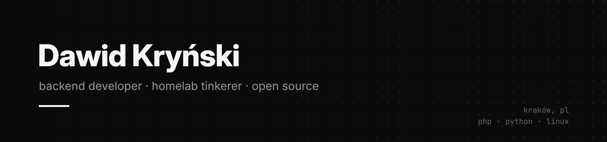

  
  
  

 

---

## about me

I'm **Dawid**, a backend developer from **Kraków** and a master's student at **Jagiellonian University**.
Day to day I write **PHP/Symfony** and **Python**. After hours I run a small **homelab** and build tools
for whatever it needs next: photos, music, downloads, smart home.

I like software that is **local-first**, boring to operate and hard to break. Most of what's public here
started as something I needed myself.

---

## tech stack

---

## projects

- **[PhotoSorter](https://github.com/DawidKrynski/PhotoSorter)** - compare two photos, pick the better one, repeat. Ranks and sorts a whole folder locally. Windows & Linux.&nbsp;
- **[MediaGrab](https://github.com/DawidKrynski/MediaGrab)** - copy a link, get the file. Desktop downloader built on yt-dlp and gallery-dl.&nbsp;

---

## immich

My tool for [Immich](https://github.com/immich-app/immich) and pull requests to the main repo.

- **[immich-album-people-hider](https://github.com/DawidKrynski/immich-album-people-hider)** - hides people who only appear in party, wedding or meme albums.&nbsp;
- [#31799](https://github.com/immich-app/immich/pull/31799) fix(web): remember selected search type · merged ✅
- [#31800](https://github.com/immich-app/immich/pull/31800) fix(mobile): use context search once server features are loaded

---

## homelab

A quiet mini PC that holds my photo library (**Immich**), streams my music (**Navidrome**)
and runs the house (**Home Assistant**), plus a few services I wrote myself.
Most of my side projects start there.
